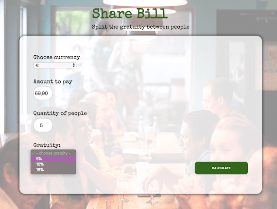

# gratuityCalculator
Are you going to the bar with your friends? 
You'll need a tip calculator. From now on each of you will know how much to pay for the tip - in every currency!

## Running the app:
https://focused-perlman-eb8428.netlify.app

 

## Technologies:
Project is created with:
* Vanilla JS
* RWD

## Install:
After you clone this repo to your desktop, go to its root directory, click right on index.html and open live server

